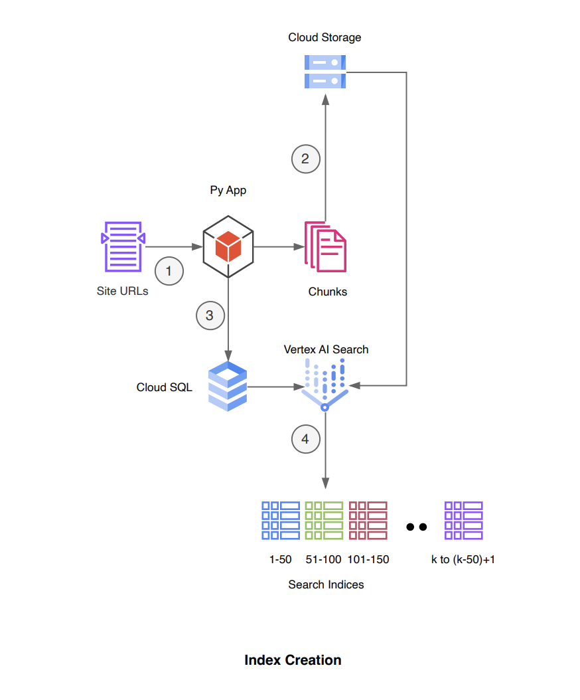
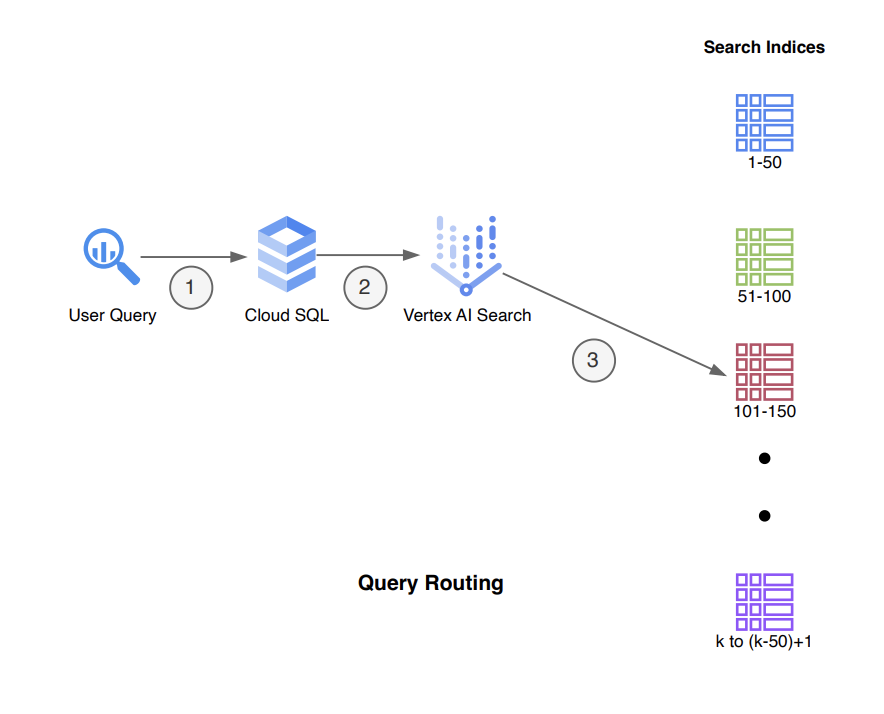

# Intelligent Document Discovery with Vertex AI Search

This repository contains a Python pipeline designed to automate URL batching for creating search applications leveraging Google Cloud's Vertex AI Search. By following the steps outlined below, you will set up a local development environment, configure necessary dependencies, and prepare your system for intelligent document discovery.

## Prerequisites

Before you begin, ensure you have the following installed on your machine:

- Python 3.6 or later
- Git

Additionally, you will need to have a Google Cloud Platform account and a project set up with the Vertex AI API enabled. Ensure you have the necessary permissions to create service accounts and manage API keys.

## Installation

### Clone the Repository

Start by cloning this repository to your local machine. Open a terminal and run the following command:

```bash
git clone https://github.com/arunpshankar/VertexAI-Document-Discovery.git
cd VertexAI-Document-Discovery
```

### Create a Virtual Environment

Within the repository directory, create a Python virtual environment to manage your project's dependencies separately from your global Python installation:

```bash
python3 -m venv .VertexAI-Document-Discovery
```

Activate the virtual environment with the following command:

For macOS/Linux:

```bash
source .VertexAI-Document-Discovery/bin/activate
```

For Windows:

```bash
.VertexAI-Document-Discovery\Scripts\activate
```

### Upgrade pip and Install Dependencies

Ensure you have the latest version of pip installed:

```bash
python3 -m pip install --upgrade pip
```

### Configure Service Account Credentials

1. **Create a Credentials Folder:**

   Inside the repository directory, create a folder named `credentials` to store your Google Cloud service account key:

   ```bash
   mkdir credentials
   ```

2. **Generate a Service Account Key:**

   - Navigate to the [Google Cloud Console](https://console.cloud.google.com/).
   - Go to the "IAM & Admin" section, then select "Service Accounts."
   - Find the service account you wish to use or create a new one.
   - Once you've selected a service account, navigate to the "Keys" tab.
   - Click "Add Key" and select "JSON." A JSON file containing your key will be downloaded.

3. **Store the Service Account Key:**

   Move the downloaded JSON file into the `credentials` folder and rename it to `key.json`.

<p align="center">
  
</p>

<p align="center">
  
</p>


